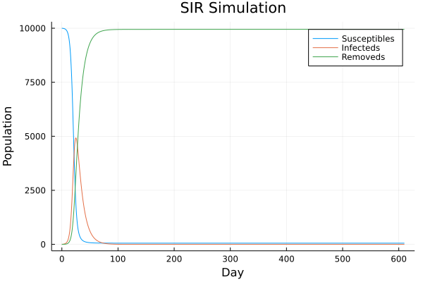

## Week 03

#### SIR Model

The [SIR Model](https://www.maa.org/press/periodicals/loci/joma/the-sir-model-for-spread-of-disease-the-differential-equation-model) is a compartmental model and it is used to formalise an epidemic. It consists on three compartments: 

* `Susceptible` (S) : people at risk
* `Infected` (I) : people that currently have the disease
* `Removed` (R) : people that have no longer the disease

> Over time they will evolve, therefore we should express them in terms of time : S(t), I(t), R(t)

The goal is to predict S(t+1), I(t+1), R(t+1). 

The number of suscpetible people will increases as the number of infected people increases, weighted with a parameter lambda, therefore:

=S(t_i)-{\lambda}S(t_i)I(t_i)dt)

=S(t_i)-{\lambda}S(t_i)I(t_i)dt)

> There is a problem on rendering the latex symbol "plus", therefore here I will use the plus/minus symbol as just "plus"!

The loss rate for the infected is proportional to the number of susceptible people but we may remove a fraction of them (weighted with gamma)


=I(t_i)+{\lambda}S(t_i)I(t_i)dt-{\gamma}I(t_i)dt)

=I(t_i)+{\lambda}S(t_i)I(t_i)dt-{\gamma}I(t_i)dt)

Finally, the number of "removed" people cannot have a loss term but only a gain one, weighted with gamma.

=R(t_i)+{\gamma}I(t_i)dt)

=R(t_i)+{\gamma}I(t_i)dt)

Now we can model these equations through a julia function that takes the current values of S,I and R and will return its updated parameters.

First, we have to set the constant that we will need:

```julia
dt = 0.5 # two steps per day
lambda = 1/200;
gam = 1/10; # gamma is a function of stats
```


```julia
function updateModel(vector)
    s = vector[1];
    i = vector[2];
    r = vector[3];

    updated_s = s - lambda*s*i*dt
    updated_i = i + lambda*s*i*dt - gam*i*dt
    updated_r = r + gam*i*dt

    return [updated_s updated_i updated_r]
end

s,i,r = 1000., 10, 20
vec = [s i r]

updateModel(vec)
```

In order to take a simulation we need something more. In particular we need to set the number of steps and the initial values. 

```julia
lambda = 1/20000 # infection rate parameter 
gam = 1/10       # recovery rate parameter  
dt = 0.5         # length of time step in days (two days)
tfinal = 610;    # number of days
s0 = 10000.0     # initial S
i0 = 4.          # initial I 
r0 = 0.          # initial R

nsteps = round(Int64, tfinal/dt)    
resultvals = Array{Float64}(undef, nsteps+1, 3)  
timevec = Array{Float64}(undef, nsteps+1)        
resultvals[1,:] = [s0, i0, r0]  
timevec[1] = 0.                 
```

Finally, we just need to update our vector for all the given steps

```julia
for step  = 1:nsteps
    resultvals[step+1, :] = updateModel(resultvals[step, :])
    timevec[step+1] = timevec[step] + dt
end
```

Graphically, it will be something like this:

```julia

using Plots
gr()

plot(timevec, resultvals,  # we should of course at a minimum provide some labels
title  = "Example of SIR results",
xlabel = "Epidemic day",
ylabel = "Population size",
label  = ["Susceptibles" "Infecteds" "Removeds"]
)
```

<p align="center">

</p>

> The code is available [here](../JuliaFiles/week_03_sir.jl).
