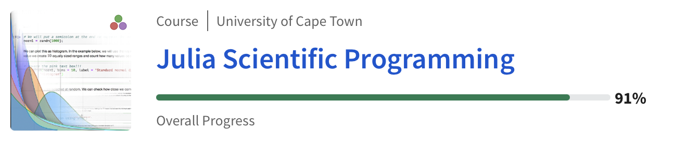
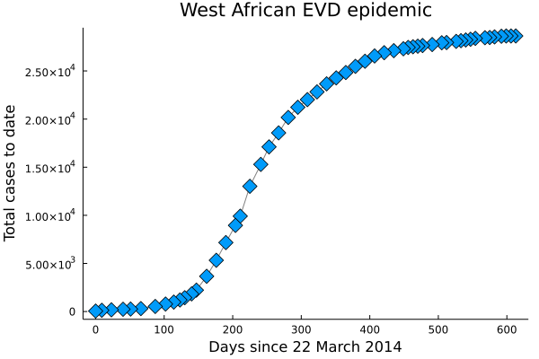
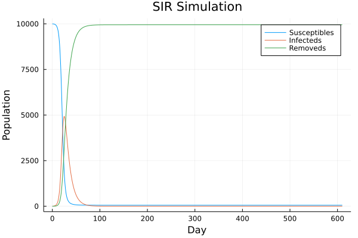

# Julia Scientific Programming

This repository contains notes and exercises taken from [Julia Scientific Programming](https://www.coursera.org/learn/julia-programming/home/week/1) course offered by University of Cape Town on Coursera. 

This course aims to teach the basic syntax of Julia and its core features. I highly recommend this course for those interested in Scientific Programming and High Performing Computers. 

> This course can be followed for free. You will just lose the opportunity to receive a final certification.

You can find all the weekly notes under the [Notes](Notes) folder and the code under the [JuliaFiles](JuliaFiles) folder.

---

<p align="center">
    
</p>

----

#### Table of contents

- [Week 01](#w1)
  - [Why Julia is so special](#w1_why)
  - [REPL](#w1_repl)
  - [Logical expression](#w1_logical_expression)
  - [Type systems](#w1_type_systems)
  - [Functions](#w1_functions)
- [Week 02](#w2)
  - [Managing CSV files](#w2_csv)
  - [Plots](#w2_plots)
- [Week 03](#w3)
  - [SIR Model](#w3_sir)
- [Week 04](#w4)
  - Descriptive statistics
  - Inferential statistics
   
----

<a name="w1" />

## Week 01 

<a name="w1_why" />

#### Why Julia is Special

* Julia is `easy` to learn (like Python or Matlab)
* Julia is `fast` (like C or Fortran)
* Julia is `free` (like Python or R)

* Julia is `dynamically typed` (i.e. the type of a variable is checked during run-time)
* Julia functions have `multiple dispatch`
* Julia supports `parallel computing` and it is `concurrent`
* Julia interfaces well with `other languages`

* Julia is `interpreted` but it uses just-in-time compilation to compile tiny bits of code

<a name="w1_repl"/>

#### REPL and Arithmetical Expressions

> Basic info about the syntax

<a name="w1_logical_expression"/>

#### Logical Expression

One key feature is that it is possible to leverage the and (&&) operator in order to execute a function.

```julia
condition && function(param)
```

If "condition" will be true, then function() will be executed!

<a name="w1_type_systems"/>

#### Type System
* Julia compares values correctly, even if the types differ (2.0 == 2 -> true)
* The operator === will also check the type (2.0 === 2 -> False)

In Julia the types are defined through hierarchies and we can use "broader" types in order to generalize.

> Int64 -> Signed -> Integer -> Real

The father of all the types is `any`. However, Julia must work with concrete types. The abstract types can be used to specify the code. 

<a name="w1_functions"/>

#### Functions

One of the key features is the `multiple dispatch`. In Julia any function can have many bodies, according to different data types. It is very powerful because it allows to deal with different input data types. Obviously, each method will have its on snipped of code. 

> sin(1) and sin(1.) will actually point to different methods (of the same function)

##### Single line functions
```julia
square_single_line(x) = x^2
square_single_line(3) # 9 
```

##### Multi line functions
```julia
function square_single_line(x)
    x^2
end
square_single_line(3) # 9
```

##### Function with multiple methods

> Recall that a function may have multiple methods

```julia
pow(x) = x # x^1
pow(x,y) = x^y # x^y

# pow(3) = 3
# pow(3,2) = 3^2 = 9
```

We may also "force" the input type:

```julia
pow(x::Int64) = x # x^1
pow(x::Int64,y::Int64) = x^y # x^y
```

----

<a name="w2" />

## Week 02

<a name="w2_csv" />

#### Managing csv files

##### Read file

```julia
wikiEVDraw = DelimitedFiles.readdlm("../Assets/wikipediaEVDraw.csv", ',') 
```

##### Manipulate dates

First, we convert the data from "25 Nov 2015" to 2015-11-25T00:00:00.

```julia
date_column = wikiEVDraw[:,1]

for idx = 1:length(date_column)
    date_column[idx] = Dates.DateTime(date_column[idx], "d u y")
end
```

After that we convert the date as an incremental variable, starting from the day 0 of the epidemic (22 March 2014 - position 54).

```julia
daysincemar22(x) = Dates.datetime2rata(x) - Dates.datetime2rata(date_column[54])
epidays = Array{Int64}(undef,54)
for idx = 1:length(date_column)
    epidays[idx] = daysincemar22(date_column[idx])
end
```

Finally, we can update the column and store the whole dataset in a new CSV file.

```julia
wikiEVDraw[:,1] = epidays
DelimitedFiles.writedlm("../Assets/WikipediaEVDdatesconverted.csv", wikiEVDraw, ',')
```

<a name="w2_plots" />

#### Plots

In order to plot, we extract the dates (x-axis) and the number of cases (y-axis).

```julia
epidays = EVDdata[:, 1]  
allcases = EVDdata[:, 2] 
```

Then, we start the backend that will manage the plots.

```julia
gr() 
```

Finally we are able to plot the data, defining title, labels, line, marker and so on.

```julia
plot(epidays, allcases,
     title = "West African EVD epidemic", 
     xlabel = "Days since 22 March 2014",
     ylabel = "Total cases to date",
     marker = (:diamond, 8),  
     line = (:path, "gray"),  
     legend = false,
     grid = false)    

savefig("Assets/EVD.png")
```

<p align="center">

</p>

> The code is available [here](../JuliaFiles/week_02_convert_dates.jl) and [here](../JuliaFiles/week_02_plots.jl). 

---

<a name="w3" />

## Week 03

<a name="w3_sir" />

#### SIR Model

The [SIR Model](https://www.maa.org/press/periodicals/loci/joma/the-sir-model-for-spread-of-disease-the-differential-equation-model) is a compartmental model and it is used to formalise an epidemic. It consists on three compartments: 

* `Susceptible` (S) : people at risk
* `Infected` (I) : people that currently have the disease
* `Removed` (R) : people that have no longer the disease

> Over time they will evolve, therefore we should express them in terms of time : S(t), I(t), R(t)

The goal is to predict S(t+1), I(t+1), R(t+1). 

The number of suscpetible people will increases as the number of infected people increases, weighted with a parameter lambda, therefore:

=S(t_i)-{\lambda}S(t_i)I(t_i)dt)

=S(t_i)-{\lambda}S(t_i)I(t_i)dt)

> There is a problem on rendering the latex symbol "plus", therefore here I will use the plus/minus symbol as just "plus"!

The loss rate for the infected is proportional to the number of susceptible people but we may remove a fraction of them (weighted with gamma)


=I(t_i)+{\lambda}S(t_i)I(t_i)dt-{\gamma}I(t_i)dt)

=I(t_i)+{\lambda}S(t_i)I(t_i)dt-{\gamma}I(t_i)dt)

Finally, the number of "removed" people cannot have a loss term but only a gain one, weighted with gamma.

=R(t_i)+{\gamma}I(t_i)dt)

=R(t_i)+{\gamma}I(t_i)dt)

Now we can model these equations through a julia function that takes the current values of S,I and R and will return its updated parameters.

First, we have to set the constant that we will need:

```julia
dt = 0.5 # two steps per day
lambda = 1/200;
gam = 1/10; # gamma is a function of stats
```


```julia
function updateModel(vector)
    s = vector[1];
    i = vector[2];
    r = vector[3];

    updated_s = s - lambda*s*i*dt
    updated_i = i + lambda*s*i*dt - gam*i*dt
    updated_r = r + gam*i*dt

    return [updated_s updated_i updated_r]
end

s,i,r = 1000., 10, 20
vec = [s i r]

updateModel(vec)
```

In order to take a simulation we need something more. In particular we need to set the number of steps and the initial values. 

```julia
lambda = 1/20000 # infection rate parameter 
gam = 1/10       # recovery rate parameter  
dt = 0.5         # length of time step in days (two days)
tfinal = 610;    # number of days
s0 = 10000.0     # initial S
i0 = 4.          # initial I 
r0 = 0.          # initial R

nsteps = round(Int64, tfinal/dt)    
resultvals = Array{Float64}(undef, nsteps+1, 3)  
timevec = Array{Float64}(undef, nsteps+1)        
resultvals[1,:] = [s0, i0, r0]  
timevec[1] = 0.                 
```

Finally, we just need to update our vector for all the given steps

```julia
for step  = 1:nsteps
    resultvals[step+1, :] = updateModel(resultvals[step, :])
    timevec[step+1] = timevec[step] + dt
end
```

Graphically, it will be something like this:

```julia

using Plots
gr()

plot(timevec, resultvals,  # we should of course at a minimum provide some labels
title  = "Example of SIR results",
xlabel = "Epidemic day",
ylabel = "Population size",
label  = ["Susceptibles" "Infecteds" "Removeds"]
)
```

<p align="center">

</p>

> The code is available [here](../JuliaFiles/week_03_sir.jl).

---

<a name="w4" />

## Week 04

The last section of this course is devoted to the flavours of `descriptive` and `inferential` statistics, with an overview of some useful packages and functions.

I did not report here my notes here, because they would be exactly equal to their notebooks. Therefore, I highly recommend to follow their material to know a bit more on the topic!
